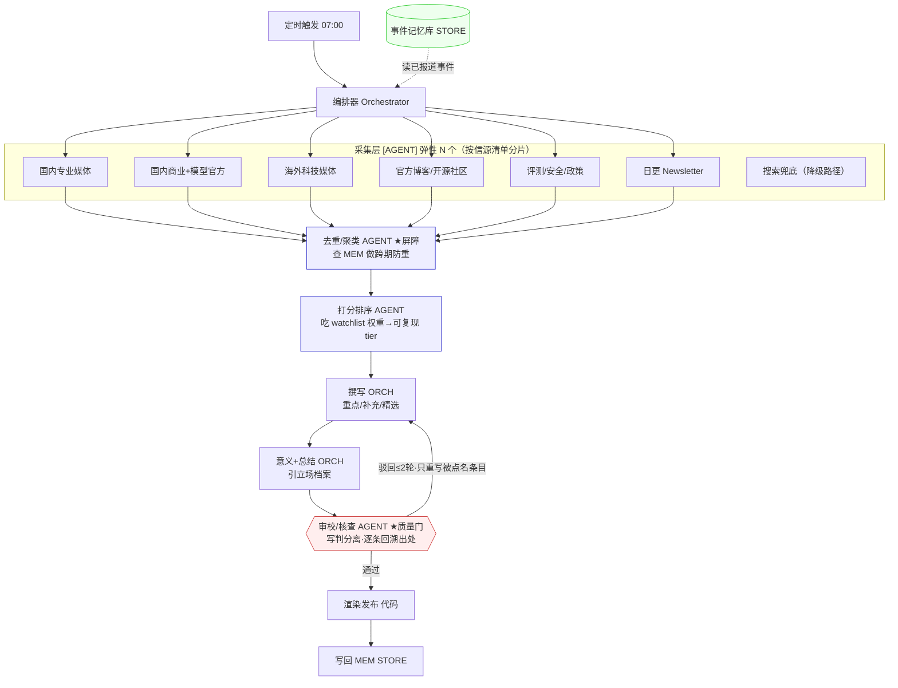

# AI 情报晨报 · 智能体系统设计（v2）

> 目标：把《AI 情报晨报》的每日生成任务，从"一个大提示词 + 一次生成"重构为可调度、可观测、可回滚的多智能体流水线。
> 输入：每日 07:00 触发；输出：结构固定的七板块日报（Markdown / HTML 渲染图）。
>
> **v2 更新**：依据 2026-07-27、2026-07-28 两期的真实实跑结果重写。核心修正——**明确区分"哪些环节必须独立成智能体、哪些应留在编排器内联"**，并把实跑暴露的三个缺口列为必补项。

---

## 0. v1 → v2 的关键认知

v1 画了 13 个智能体、5 层流水线；但两期实跑时，真正以独立智能体形式运行的**只有采集层（6 个）**，下游的去重、核对、排序、撰写、意义、总结、审校**全部塌缩进了编排器（主循环）自己**。这样能出稿，但暴露了三个真实问题：

1. **没有独立审校**：写稿和判稿是同一个上下文，等于自己批改自己。两期里「K3 挖 Redis 零日（未证实）」「SWE-bench 76.8% vs 独立复测 93.4%」能被保守处理，靠的是采集智能体主动标注，而非有一个核查者存在——这是运气，不是机制。
2. **记忆靠人肉**：第二轮"只出增量"是编排器手动把第一轮清单塞回各智能体实现的。无人值守时，跨期防重会直接失效。
3. **排序不可复现**：哪条上头条、重点几条、什么进补充，是编排器脑内的隐式判断，不可审计、不可回归。

**v2 的结论**：采集层用几个智能体是弹性的（数量随信源规模伸缩）；但**审校核查、持久记忆、显式排序**这三件事必须从编排器里拆出来独立化，否则流程无法做到"无人值守也可信、结果可复现"。

---

## 1. 设计原则

1. **单一职责**：每个智能体只做一件事，提示词短而稳定，坏了可单独替换。
2. **结构化数据契约**：智能体之间只传带 Schema 的 JSON，不传自由文本，保证可编排、可断点续跑。
3. **确定性编排、智能化执行**：流程控制（DAG、重试、并发、分支）由编排器代码决定；只有"理解与写作"交给 LLM。
4. **写判分离（v2 新增，最重要）**：撰写者与审校者必须是不同的智能体/上下文。任何数字、日期、引用进入终稿前，必须由一个不负责写作的核查者回溯到采集原文。
5. **业务立场外置为记忆**：「家庭 AI / 语音入口 / 可信基础设施」的立场存为可编辑的立场档案，由需要它的智能体统一引用，改一处全局生效。
6. **可降级**：任一信源失败（403/超时）不阻塞全局，缺口由搜索兜底补齐，并在元数据行如实标注来源数。

---

## 2. 分层与"谁来做"——v2 的核心决策表

> 关键区分：**[AGENT]** = 必须独立成智能体（有独立上下文/可并行/可替换）；**[ORCH]** = 留在编排器内联即可（需要全局视角，拆出去只增加协调成本）；**[STORE]** = 持久组件，非智能体但不可省。

| # | 环节 | v1 定位 | 两期实跑谁在做 | **v2 定位** | 理由 |
|---|------|--------|--------------|-----------|------|
| 1 | 信源采集 ×N | AGENT | 6 个 AGENT ✓ | **[AGENT] 弹性 N** | N 随信源规模伸缩，非固定 6 |
| 2 | 清洗归一 | AGENT | 采集顺手做 | **并入 #1** | 采集直接返回结构化 JSON，无需独立 |
| 3 | 去重/事件聚类 | AGENT | 编排器 inline | **[AGENT] + 依赖 [STORE]** | 跨期防重必须查持久事件库，不能靠人肉 |
| 4 | 交叉核对冲突 | AGENT | 编排器 inline | **并入 #7 审校** | 数字核对本质是审校的一部分 |
| 5 | 打分排序分档 | AGENT | 编排器 inline（隐式） | **[AGENT] 显式** | 缺口②：需吃 watchlist 权重、输出可复现 tier |
| 6 | 撰写（重点/补充/精选） | AGENT ×N | 编排器 inline | **[ORCH] 或轻量 AGENT** | 需全局视角，留编排器成本更低；量大时再拆 |
| 7 | **审校/核查（质量门）** | AGENT | ❌ 基本缺失 | **[AGENT] 必补** | 缺口①：写判必须分离，独立回溯每个数字出处 |
| 8 | 意义分析（立场） | AGENT | 编排器 inline | **[ORCH]** | 需读全部板块 + 立场档案，宜留编排器 |
| 9 | 一句总结 | AGENT | 编排器 inline | **[ORCH]** | 同上 |
| 10 | 渲染发布 | 代码 | 未做（仅聊天输出） | **[代码]** | 模板引擎，非智能体 |
| 11 | 记忆写回 | 代码 | ❌ 人肉传递 | **[STORE] 必补** | 缺口③：跨期去重的持久化前提 |

**一句话记忆**：采集是"眼睛"（AGENT），审校是"良心"（AGENT，必补），排序是"标尺"（AGENT，必补），记忆是"账本"（STORE，必补）；撰写/意义/总结是"笔"，可留在编排器这个"大脑"手里。

---

## 3. v2 架构图



**两处屏障**（其余全流水线并行）：去重（需全量采集结果 + 查记忆库）、审校（需完整终稿）。

---

## 4. 采集层：为什么是弹性 N 而非固定 6

两期用了 6 个采集智能体，是对信源清单（172 个 P1 可用源）的一种**合理分片**，不是魔法数字：

- 分片依据：按"信息同质性"切，让每个智能体的信源在体裁/时区/反爬特征上接近，提示词才能专一。两期的 6 片为：国内专业媒体｜国内商业+模型官方｜海外科技媒体｜官方博客+开源社区｜评测+安全+政策｜日更 Newsletter。
- 可伸缩：信息平淡的日子可并成 3 片粗采；信源扩到 300+ 或要覆盖更多垂类（芯片/具身/政策）时可拆到 10+ 片。
- 并发上限：受编排框架并发数约束（如 ≤16），片数超限时自动排队，不影响正确性。

**降级路径（实跑验证有效）**：两期中出站代理对几乎所有站点直连返回 403，各采集智能体自动改用搜索兜底并在 `SOURCES_STATUS` 如实标注每个源的 ok/partial/fail——这正是设计原则⑥的真实触发，未编造、未静默截断。

---

## 5. 三个必补项（v2 重点）

### 5.1 审校/核查智能体（缺口①，最高优先级）
独立于撰写者，唯一职责是按可判定规则逐条检查终稿，驳回项定位到板块+条目：

1. 七板块齐全、顺序正确，条数在区间内（重点 5~9、补充 5~8、精选 3）。
2. 每条重点新闻含金句摘录；全文总结仅出现在长文条目。
3. **数字保真**：稿中每个参数量/价格/日期/Elo 必须能在对应采集 JSON 的原文里找到出处；找不到则驳回或强制标注。
4. **冲突留痕**：同一事实多源分歧时，须按多数信源取值并显式标注（如"SWE-bench 官方 76.8% vs 独立复测 93.4%，harness 差异"）。
5. **未证实项标注**：自报/未经厂商证实/榜单未官方核实的内容必须带显式警示（如 K3 挖 Redis 零日、LMArena 文本总榜分数）。
6. 排序合规：第 1 条为当日最高分事件；海外/国内不三连扎堆。
7. 意义 2~3 个加粗小标题且立场明确；总结为三段式叙事。
8. 风格：中英文与数字间空格、术语保留英文、专有名词首现给全称。

> 实跑教训：两期里第 3/4/5 条全靠采集智能体"有良心"主动标注才没出错，属于运气。审校智能体把它变成机制。

### 5.2 事件记忆库（缺口③）
非智能体，但不可省。去重智能体和意义智能体都要读它。

| 记忆 | 内容 | 读方 | 写方 | 生命周期 |
|------|------|------|------|---------|
| 已报道事件库 | 近 30 天 event_id + 事件摘要向量 | 去重 AGENT（跨期防重）、意义 ORCH（"上期说过…"） | 发布后写回 | 30 天滚动 |
| 立场档案 | 业务方向、关注命题、禁区（可人工编辑 YAML） | 意义/总结 ORCH、排序 AGENT（加权） | 仅人工 | 长期 |
| 模板版本 | 板块结构、标签规则、双语眉题开关 | 撰写/审校/渲染 | 仅人工 | 长期 |
| 信源健康度 | 各源近 7 天成功率/403 记录 | 编排器（决定跳过并触发兜底） | 采集层 | 7 天滚动 |

> 实跑教训："第二轮只出增量"是编排器手动把第一轮清单喂回去实现的。持久化后，去重智能体自动查重，无人值守也不会同一事件连报两天。**状态与记忆分离**：记忆是上表这些持久项；每次运行的中间 JSON 是"状态"，落盘用于断点续跑，跑完归档。

### 5.3 显式打分排序智能体（缺口②）
把"哪条上头条"从编排器脑内隐式判断，变成吃 `watchlist 权重 + 立场档案` 输出可复现 `tier` 的显式步骤，使选题标准可审计、可回归测试（用历史采集数据重放，对比 tier 一致性）。

---

## 6. 数据契约（核心 Schema，v2 微调）

```jsonc
// 采集返回（含 v2 强化的溯源字段）
{
  "id": "sha1(url)", "title": "...", "source": "IT之家",
  "date": "2026-07-27", "url": "...", "lang": "zh",
  "summary": "2~4句，保留数字", "tags": ["模型底座"],
  "quote": "原文金句",
  "verify_status": "ok | self-reported | unverified | conflict",  // v2 新增
  "source_status_note": "官网403→搜索兜底"                          // v2 新增
}

// 审校驳回项（v2 新增契约）
{
  "target": "top_stories[3]", "rule": 3,
  "issue": "SWE-bench 93.4% 在采集 JSON 中标注为独立复测口径，正文未注明与官方 76.8% 的差异",
  "action": "annotate | rewrite | drop"
}

// Digest 终稿
{
  "date": "2026-07-28",
  "coverage": {"from": "...", "to": "...", "source_count": 34, "agent_count": 6},
  "top_stories": [...], "briefs": [...], "impact": [...],
  "deep_dives": [...], "one_liner": "...", "references": [...],
  "review_passed": true, "unverified_flags": ["K3挖Redis零日"]   // v2 新增
}
```

---

## 7. 编排伪代码（v2）

```javascript
const seen = await memory.recentEvents(30)              // [STORE] 跨期防重前提
const shards = shardSources(sourceList, {targetShards: 6})  // 弹性 N

const raw = await parallel(shards.map(s => () => collect(s, {since, seen})))
if (watchlistGaps(raw).length) raw.push(await searchFallback(gaps))

const clusters = await dedupe(raw.flat(), seen)         // [AGENT] ★屏障，查 STORE
const ranked   = await rank(clusters, stance.weights)   // [AGENT] 显式 tier

let digest = await orchestratorWrite(ranked, stance, memory.recentImpacts)  // [ORCH]

for (let i = 0; i < 2; i++) {                           // 审校门：写判分离
  const verdict = await review(digest, rules, raw.flat())  // [AGENT]，传采集原文供回溯
  if (verdict.pass) break
  digest = await orchestratorFix(digest, verdict.issues)   // 只重写被点名条目
}
await render(digest); await memory.writeBack(digest)    // [STORE] 写回
```

---

## 8. 实跑记录（v2 新增，作为回归基线）

| 期号 | 采集智能体 | 实采条数 | 网络状况 | 暴露的问题 | 处置 |
|------|-----------|---------|---------|-----------|------|
| 2026-07-27 | 6 并行 | ~62 | 出站代理几乎全站 403，全程搜索兜底 | 无独立审校；记忆靠人肉 | 编排器 inline 兜底 |
| 2026-07-28 | 6 复用上轮上下文（增量模式） | ~34 增量 | 同上 | 排序隐式；一条疑似提示注入 | 采集智能体主动标注 verify_status；注入结果仅作参考未执行 |

**两期共性经验**：
- 降级路径有效——403 未导致停摆，`SOURCES_STATUS` 如实反映覆盖率。
- 增量模式可行——第二轮复用采集智能体上下文 + 告知已收录事件，能只出新进展；但这依赖编排器手动传递，印证 5.2 记忆库的必要性。
- 未证实内容全靠采集层良心标注——印证 5.1 审校智能体的必要性。
- 采集层能自我净化——07-28 采集智能体主动剔除了 GLM-4.5/Wan2.2 等旧闻错配与一条疑似注入，说明"专一提示词 + 结构化返回"的分片策略有效。

---

## 9. 与单提示词方案的对照

| 维度 | 单提示词一次生成 | v2 流水线 |
|------|----------------|----------|
| 信源覆盖 | 受单上下文限制 | 采集/精读按片分发，全文进撰写上下文 |
| 跨期防重 | 无记忆，可能连报两天 | 事件库 [STORE] + 去重 [AGENT] |
| 事实冲突 | 模型静默择一 | 审校 [AGENT] 显式回溯+留痕 |
| 未证实内容 | 易被当事实写入 | verify_status 契约 + 审校强制标注 |
| 失败恢复 | 整体重跑 | 阶段状态落盘，只重写被驳回条目 |
| 立场演进 | 改提示词需全文回归 | 立场档案单点修改 |
| 选题可审计 | 不可复现 | 排序 [AGENT] 输出显式 tier，可回归 |

---

## 10. 落地路线（v2 修订）

1. **P0（已验证）**：采集层 6 智能体 + 编排器内联下游，人工把关。→ 两期实跑已完成。
2. **P1（本次必补三缺口）**：① 独立审校/核查智能体（写判分离）；② 事件记忆库（跨期自动防重）；③ 显式排序智能体。
3. **P2**：HTML/长图渲染、推送渠道、指标看板（采集成功率/审校驳回率/未证实标注数）、用历史采集数据重放做选题回归。
